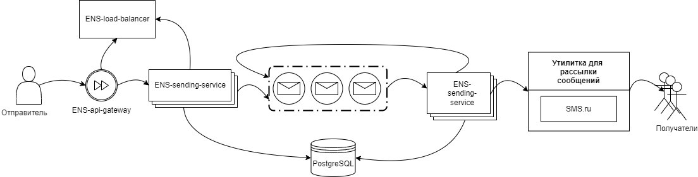
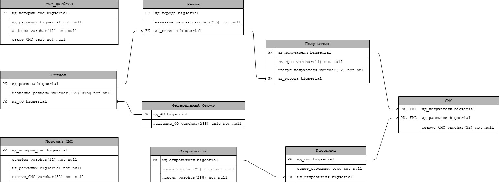

# Высоконагруженная отказоустойчивая система SMS-оповещения в чрезвычайных ситуациях

--- 

## Стек

- Java 17
- Spring Boot
- Spring MVC
- Spring Security
- Spring Data JPA
- PostgreSQL
- RabbitMQ
- Docker
- Thymeleaf
- Bootstrap
--- 

## Задача и требования к ПО. 
- Задача заключается в гарантированной доставке сообщения.
- Ввиду того, что одно оповещение может спасти жизнь или
здоровье абонента, выдвигается требование о том, что КАЖДОЕ сообщение
КАЖДОМУ пользователю обязано быть доставленным. Для данного
требования следует предусмотреть ситуации, когда какие-любо части системы
выходят из строя прямо в процессе отправки оповеещений.
- Ввиду (потенциально) большого количества абонентов и
возможность отправки нотификации абонентам оператора сотовой связи по
все стране, выдвигается требование о том, что система должна выдерживать
оповещения на сотни тысяч – миллионы абонентов.
- Ввиду потенциального роста количества абонентов, выдвигается
требование о лёгком горизонтальном масштабировании системы с
сохранением отказоустойчивых свойств.
--- 

## Дизайн системы.

#### В системе используется микросервисная архитектура
#### ***ENS-load-balancer*** 
    - Spring boot микросервис
    - Реестр клиентов балансировщика нагрузки по технологии Netflix Eureka
#### ***ENS-api-gateway*** 
    - Spring boot микросервис
    - Сам шлюз на который происходит обращение по технологии Netflix Eureka
#### ***ENS-request-service*** 
    - Cервис создания запросов по технологии Netflix Eureka, обращение на один экземпляр из нескольких запущеных происходит через единый api gateway
    - Spring boot микросервис. Способен работать в нескольких экземплярах
    - Веб интерфейс для управлени основными сущностями и отправки рассылки
    - Фронтенд сделан путём Spring MVC, thymeleaf, bootstrap
    - Взаимодействие с БД путём Spring DataJPA
    - Аутентификация при помощи Spring Security - пароли в БД зашифрованы
    - Сообщения из этого сервиса поступают в очередь RabbitMQ
#### ***ENS-sending-service*** - сервис отправки сообщений
    - Spring boot микросервис. Способен работать в нескольких экземплярах
    - Получает сообщения с очереди RabbitMQ
    - Делает запрос на отправку сообщения получателем при помощи сервиса SMS.ru
    - Ввиду невозможности реальной бесплатной отправки при помощи SMS.ru в тестовой среде поставлена TODO-заглушка - сообщение с кодами 200 и 204 считается успешно отправленным. Также при реальном запуске следует указывать свой настоящий токен, полученный от SMS.ru
    - При неудачном запросе сообщение сохраняется для повторной отправки
    - По шедулеру каждые 5 минут не отправившиеся сообщения пробуется переотправить, переотправка происходит единожды
    - Для всех сообщений ведётся история в отдельной таблице вне зависимости от результатов
#### ***Брокер RabbitMQ*** 
    - Имеет две очереди, но не неограничен в масштабировании
    - Очередь queue1 для первичной отправки сообщений
    - Очередь callback1 для переотправки
[Ссылка на настроенный Docker образ](https://hub.docker.com/r/vbutyavka/ens-rabbit-repo)
#### 6 ***База данных Postgresql***
    - PostrgeSQL база данных, скрипты лежат в корне папке src.
    - Настроена репикация по принципу master-slave

--- 

## Запуск
На Windows в докер контейнерах - запустить скрипт по пути:
> src/main/resources/scripts/up-docker-conteiners.ps1